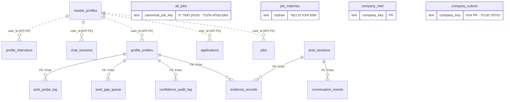
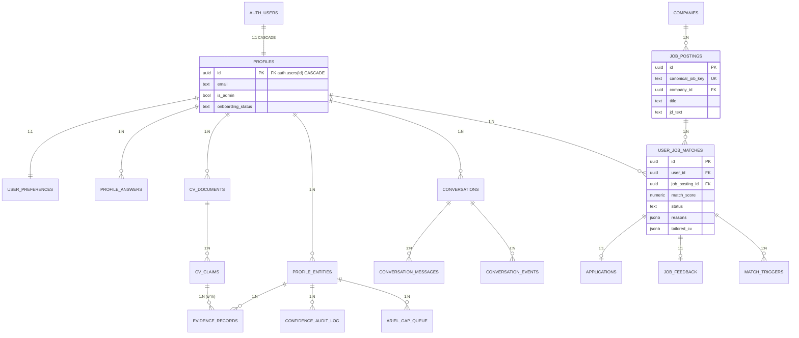

# הצעת ארכיטקטורה: עיצוב מחדש של מסד הנתונים (Supabase / Postgres)

> **סטטוס:** הצעת תכנון בלבד. לא בוצעו שינויים ב-DB, לא הורצו שאילתות, ולא נכתב קוד יישום.
> **בסיס הניתוח:** קוד המקור, מיגרציות Alembic (`backend/alembic_app_schema/`), ומודלי ה-ORM
> (`backend/models/`) — לא שאילתות חיות, בהתאם להנחיה.
> **מסמכים קשורים:** `docs/multi-tenant-erd.md`, `docs/architecture-boundaries.md`, `CLAUDE.md`.

---

## 1. תקציר מנהלים — חמישה ממצאים שמכתיבים את התכנון

| # | ממצא | חומרה | השלכה על התכנון |
|---|---|---|---|
| **A** | **אין שום Foreign Key ל-`auth.users`** בכל 23 הטבלאות. `user_id` הוא `TEXT` חופשי בכל מקום. | 🔴 קריטי | שום דבר לא מונע `user_id` שגוי/מומצא. זה שורש ממצא B. |
| **B** | **`master_profiles` מזוהמת בנתוני טסטים** — הטבלה מכילה 188 שורות, אך כל הדגימות שנבדקו הן `handler-compose-*`/`handler-update-*` שנוצרו ע"י `backend/tests/test_proficiency_update.py` שרץ מול ה-DB האמיתי. ⚠️ **הספירה המדויקת לא אומתה** (לא הורצו שאילתות) — יש לאמת לפני מחיקה. | 🔴 קריטי | קוד פרודקשן כבר גידל עקיפה: `_NON_ACCOUNT_USER_ID_PREFIXES` ב-`backend/scripts/ingest_pasted_job.py`, שמתאר את החשבון האמיתי כ"השורה היחידה שאינה placeholder". יש לתקן את בידוד הטסטים, לא רק את הסכמה. |
| **C** | **`job_matches` יתומה לחלוטין** — אפס אזכורים בכל הריפו, ולא הגיעה מ-SQLite. | 🟠 בינוני | מועמדת מיידית למחיקה. |
| **D** | **`jobs` מערבבת עובדות-משרה עם מצב-התאמה-פר-משתמש** — כותרת/חברה/JD יחד עם `score`, `applied`, `tailored_cv`, `why_ron`. | 🟠 בינוני | כפילות נתוני משרה לכל משתמש. זהו לב הנרמול הנדרש. |
| **E** | **ארבעה מאגרי שיחה חופפים**: `chat_sessions`, `ariel_sessions`, `conversation_events`, `profile_interviews` — כל אחד עם blob JSON משלו. | 🟡 נמוך-בינוני | איחוד למודל `conversations` + `conversation_messages`. |

**נקודת אור:** אשכול Ariel/Confidence (`profile_entities`, `evidence_records`, `ariel_sessions`,
`conversation_events`, `ariel_gap_queue`, `ariel_probe_log`, `confidence_audit_log`) **הוא היחיד שכבר
מוגדר נכון יחסית** — יש בו FKs אמיתיים ב-Postgres (ראו `413f4ed8fbc6_create_app_tables.py`, שורות 98–202).
הוא ישמש כתבנית לשאר הסכמה, לא כיעד לשכתוב.

---

## 2. סיווג 23 הטבלאות

### 2.1 Core Active — ליבה פעילה (12)

| טבלה | תפקיד | הערות לתכנון |
|---|---|---|
| `all_jobs` | קטלוג משרות גלובלי מה-scraper (LinkedIn וכו') | מקור האמת לעובדות משרה. **לא** כפילות של `jobs`. |
| `jobs` | פיד/התאמות פר-משתמש | לפירוק — ראו §3.2 |
| `applications` | מועמדויות שהוגשו | לחיבור ב-FK |
| `master_profiles` | חשבון + מסמך פרופיל JSON | לפירוק — ראו §3.1 |
| `profile_entities` | ישויות פרופיל (skill/trait/domain/experience) + ציון ביטחון | נשאר, מקבל FK תקין |
| `evidence_records` | ספר ראיות append-only | נשאר כמו שהוא |
| `confidence_audit_log` | audit trail לשינויי ציון | נשאר. ⚠️ `tenant_id` עדיין `NULL` — התיקון תלוי בבראנץ' `fix/confidence-audit-log-tenant-id` שטרם מוזג |
| `ariel_sessions` | סשנים של Ariel | לאיחוד תחת `conversations` |
| `conversation_events` | אירועי STAR שחולצו | נשאר (0 שורות כרגע, אבל הנתיב חי) |
| `ariel_gap_queue` | תור פערי ידע | נשאר |
| `company_intel` | cache מחקר חברה | לאיחוד עם `company_culture` |
| `company_culture` | cache תרבות חברה | לאיחוד עם `company_intel` |

### 2.2 Future / Draft — פיצ'רים חצי-בנויים (5)

| טבלה | מצב | פער |
|---|---|---|
| `job_feedback` | Backend מלא, **אין UI** | Ticket [JOB-127](https://linear.app/jobaplly/issue/JOB-127) פתוח |
| `recruiter_reply_drafts` | קובץ backend אחד בלבד | אין נתיב UI |
| `match_triggers` | 0 שורות | מנגנון התראות שלא הופעל |
| `shadow_match_scores` | 24 שורות, קובץ אחד | כלי כיול A/B למנוע ההתאמה |
| `ariel_probe_log` | 0 שורות, ללא ORM | טבלת raw-DDL בלבד |

**המלצה:** להשאיר את כולן, אך **לא לתכנן אותן מחדש כעת** — הן ייבנו על גבי הסכמה החדשה כשהפיצ'ר יבשיל.
היוצא דופן: `job_feedback` ו-`match_triggers` נכנסות באופן טבעי כילדות של `user_job_matches` (§3.2).

### 2.3 Obsolete / Redundant — למחיקה או איחוד (6)

| טבלה | פעולה | נימוק |
|---|---|---|
| `job_matches` | **DROP** | אפס אזכורים בכל הריפו. לא מ-SQLite. יתומה מוחלטת. |
| `chat_sessions` | **MERGE** → `conversations` | blob של `messages_json`; חופף ל-`ariel_sessions` |
| `profile_interviews` | **MERGE** → `conversations` | סשן שיחה עם blob; חופף מושגית |
| `company_culture` | **MERGE** → `companies` | אותו PK (`company_key`), אותו דפוס בדיוק כמו `company_intel` |
| `kv_store` | **להשאיר, אך לתייג** | תשתית תפעולית (דגלי scraper) — לא דאטת משתמש. לא חלק מהמודל היחסי. |
| `alembic_version`, `alembic_version_app_schema` | **להשאיר** | תשתית מיגרציות. שתיהן נחוצות — הן עוקבות אחרי שני גרפי רוויזיות נפרדים. |

---

## 3. ארכיטקטורת היעד

### 3.1 מודל המשתמש והפרופיל — מ-blob למודל יחסי

**הבעיה היום:** `master_profiles` היא שלוש טבלאות שנדחסו לאחת:
1. טבלת חשבון (`user_id`, `email`, `is_admin`, `onboarding_status`)
2. מסמך JSON (`master_profile`) המכיל `personal`, `metrics`, `role_preferences`, `cv_claims`, `enriched_entities`
3. ללא כל קשר ל-`auth.users` → מכאן זיהום הטסטים

**היעד:**

```
auth.users (Supabase, קיים)
    └─1:1─> profiles                  ← זהות + הרשאות. PK = FK ל-auth.users(id)
              ├─1:1─> user_preferences   ← role_preferences (כותרות יעד, מיקומים, שכר)
              ├─1:N─> profile_answers    ← metrics / תשובות משלימות (question_id, answer)
              ├─1:N─> cv_documents       ← כל CV שהועלה
              │         └─1:N─> cv_claims  ← skills/experiences/education מחולצים
              └─1:N─> profile_entities   ← (קיים) ישויות + ציון ביטחון
```

**החלטות מפתח:**

- `profiles.id` הוא `UUID PRIMARY KEY REFERENCES auth.users(id) ON DELETE CASCADE`.
  זה לבדו הופך את ממצא B לבלתי אפשרי — אי אפשר להכניס `handler-compose-<uuid>` שאינו משתמש אמיתי.
- `cv_claims` מוחלף מ-JSON למודל יחסי עם `claim_type` (`skill`/`experience`/`education`) — מאפשר
  לקשר ראיה (`evidence_records`) ישירות ל-claim ספציפי, מה שכיום בלתי אפשרי.
- `enriched_entities` מה-blob **מתמזג לתוך `profile_entities`** — זו כפילות מושגית ישירה.

### 3.2 מודל המשרות — הפרדת קטלוג ממצב-משתמש

**הבעיה היום:** `all_jobs` (קטלוג גלובלי) ו-`jobs` (פיד פר-משתמש) חיים במקביל, ו-`jobs` משכפלת את
עובדות המשרה (כותרת, חברה, JD) לכל משתמש, לצד מצב ההתאמה שלו.

**היעד:**

```
job_postings         ← קטלוג גלובלי אחד (מ-all_jobs). עובדות המשרה בלבד.
    └─1:N─> user_job_matches   ← (user_id, job_posting_id) + score, status, reasons, why_ron
                ├─1:1─> applications        ← מועמדות שהוגשה
                ├─1:1─> job_feedback        ← דירוג המשתמש
                ├─1:N─> match_triggers      ← התראות
                └─1:N─> shadow_match_scores ← כיול A/B
companies            ← איחוד company_intel + company_culture
    └─1:N─> job_postings
```

`user_job_matches` הוא טבלת ה-N:M הקלאסית בין משתמש למשרה, והוא מה ש-`jobs` מנסה להיות היום.
`tailored_cv` (CV מותאם למשרה ספציפית) יושב עליו באופן טבעי.

### 3.3 מודל השיחות — איחוד ארבעה מאגרים

```
conversations          ← kind: 'ariel' | 'chat' | 'onboarding_interview'
    ├─1:N─> conversation_messages   ← הודעה אחת לשורה (במקום blob JSON)
    └─1:N─> conversation_events     ← (קיים) אירועי STAR שחולצו
```

מעבר מ-`messages_json`/`transcript_json` blob לשורה-להודעה מבטל את הצורך ב-`json_set`/`jsonb_set`
(שכבר גרם לבאג דיאלקט בבראנץ' הנוכחי) ומאפשר שאילתות/אינדוקס על תוכן שיחה.

---

## 4. דיאגרמת ERD

### 4.1 מצב נוכחי (מפושט — רק הקשרים האמיתיים)



**קריאה:** `..` = קשר לוגי ללא FK במסד. כל הקשרים ל-`master_profiles` הם כאלה.
`all_jobs` מנותקת מ-`jobs`. `job_matches` צפה באוויר.

### 4.2 ארכיטקטורת יעד



---

## 5. סכמת היעד — מפרט

### 5.1 טבלאות חדשות / משוכתבות

| טבלה | PK | FKs עיקריים | אינדקסים נדרשים |
|---|---|---|---|
| `profiles` | `id UUID` | → `auth.users(id)` **CASCADE** | `email` (unique) |
| `user_preferences` | `user_id UUID` | → `profiles(id)` CASCADE | — (1:1) |
| `profile_answers` | `id UUID` | → `profiles(id)` CASCADE | `(user_id, question_id)` unique |
| `cv_documents` | `id UUID` | → `profiles(id)` CASCADE | `(user_id, uploaded_at DESC)` |
| `cv_claims` | `id UUID` | → `cv_documents(id)` CASCADE | `(document_id, claim_type)` |
| `companies` | `id UUID` | — | `company_key` unique, `name` trigram |
| `job_postings` | `id UUID` | → `companies(id)` SET NULL | `canonical_job_key` unique, `posted_at DESC`, `(source, source_job_id)` |
| `user_job_matches` | `id UUID` | → `profiles(id)` CASCADE, → `job_postings(id)` CASCADE | `(user_id, job_posting_id)` **unique**, `(user_id, match_score DESC)`, `(user_id, status)` |
| `conversations` | `id UUID` | → `profiles(id)` CASCADE | `(user_id, kind, started_at DESC)` |
| `conversation_messages` | `id UUID` | → `conversations(id)` CASCADE | `(conversation_id, seq)` |

### 5.2 החלטות טיפוסי-נתונים (תיקון חובות מ-SQLite)

| מצב היום | יעד | נימוק |
|---|---|---|
| `user_id TEXT` | `UUID` | תואם `auth.users(id)`, מאפשר FK |
| `created_at TEXT` (ISO string) | `TIMESTAMPTZ` | כל השוואות התאריך היום הן השוואות מחרוזת |
| `manual_review_required INTEGER` (0/1) | `BOOLEAN` | עקיפה של SQLite CHECK שאין בה צורך ב-Postgres |
| `is_ai_assisted INTEGER` (0/1) | `BOOLEAN` | אותו דבר |
| `score REAL` | `NUMERIC(4,1)` | `.ai_rules` דורש דיוק של ספרה עשרונית אחת — `NUMERIC` אוכף זאת, `REAL` לא |
| `*_json TEXT` | `JSONB` | אינדוקס + ולידציה |

> ⚠️ מעבר `TEXT` → `TIMESTAMPTZ` הוא **breaking change** לכל השוואות המחרוזת ב-
> `profile_update_service.py`, `ariel_probe_service.py`, `confidence_matrix_service.py`.
> חייב להיות שלב נפרד ומבודד (§6, שלב 4).

### 5.3 סיכום פעולות

| פעולה | טבלאות |
|---|---|
| **DROP** | `job_matches` |
| **MERGE** | `company_culture` → `companies`; `chat_sessions` + `profile_interviews` → `conversations` |
| **RENAME/RESHAPE** | `all_jobs` → `job_postings`; `jobs` → `user_job_matches`; `master_profiles` → `profiles` (+ פיצול) |
| **CREATE** | `user_preferences`, `profile_answers`, `cv_documents`, `cv_claims`, `conversation_messages` |
| **KEEP AS-IS** | `profile_entities`, `evidence_records`, `confidence_audit_log`, `ariel_gap_queue`, `conversation_events`, `ariel_probe_log`, `applications`, `job_feedback`, `match_triggers`, `shadow_match_scores`, `kv_store`, `alembic_version*` |

---

## 6. אסטרטגיית מיגרציה — 7 שלבים

עיקרון מנחה: **כל שלב נפרד, הפיך, ונבדק לפני הבא.** אין שלב שמוחק נתונים לפני שהעותק החדש אומת.

| שלב | תוכן | סיכון | תנאי מעבר לשלב הבא |
|---|---|---|---|
| **0. בידוד טסטים** | לתקן ש-`backend/tests/` לא כותב ל-DB האמיתי (מקור זיהום `handler-*`) | 🟢 נמוך | הרצת הסוויטה לא יוצרת שורות חדשות ב-Dev |
| **1. ניקוי** | `DROP job_matches`; מחיקת ~186 שורות `handler-*` מ-`master_profiles` | 🟡 בינוני | ספירת שורות תואמת לצפוי; אין רגרסיה |
| **2. `companies`** | איחוד `company_intel` + `company_culture` | 🟢 נמוך | קריאות cache עובדות מהטבלה המאוחדת |
| **3. `profiles`** | יצירת `profiles` עם FK ל-`auth.users`; backfill; פיצול ה-JSON | 🔴 גבוה | כל משתמש אמיתי ממופה 1:1; אין `user_id` יתום |
| **4. טיפוסי נתונים** | `TEXT`→`TIMESTAMPTZ`, `INTEGER`→`BOOLEAN`, `REAL`→`NUMERIC` | 🔴 גבוה | כל השוואות התאריך בקוד הועברו; סוויטה ירוקה |
| **5. מודל המשרות** | `all_jobs`→`job_postings`; `jobs`→`user_job_matches` | 🔴 גבוה | הפיד וה-All Jobs tab מציגים אותם נתונים |
| **6. שיחות** | איחוד ל-`conversations` + `conversation_messages` | 🟠 בינוני | היסטוריית צ'אט נטענת במלואה |

**דפוס עבודה מומלץ לכל שלב:** Expand → Migrate → Contract (יצירת המבנה החדש לצד הישן, כתיבה כפולה,
אימות, ורק אז הסרת הישן). זה מה שמאפשר "ללא אובדן נתונים" בפועל ולא רק בכוונה.

---

## 7. החלטות פתוחות — דורשות הכרעה שלך ושל יובל

1. **`tenant_id`** — קיים על 15 טבלאות, **אף פעם לא בשימוש בשום `WHERE`** (`docs/multi-tenant-erd.md` §5).
   שתי אפשרויות: (א) להסיר עד שיהיה מודל ארגונים אמיתי; (ב) ליצור טבלת `organizations` ולהפוך אותו
   ל-FK אמיתי. **המלצתי: (א)** — עמודה מתה שצריך לסנכרן היא חוב, לא הכנה.
2. **RLS (Row Level Security)** — Supabase מאפשר אכיפת בידוד ברמת ה-DB במקום ברמת השאילתה.
   עם FK ל-`auth.users` זה נעשה טריוויאלי. **המלצתי: להפעיל** — זה הופך את בידוד המשתמשים
   מ"כל call site זוכר לסנן" ל"המסד אוכף".
3. **`kv_store`** — להשאיר כטבלה תפעולית או להעביר ל-Redis (שכבר קיים ב-`REDIS_URL`)?
4. **היקף שלב 4** (טיפוסי נתונים) — האם לבצע אותו כחלק מהעיצוב מחדש, או לדחות? הוא הכי מסוכן
   ביחס לתועלת המיידית.

---

## 8. מה המסמך הזה **לא** מכסה

- לא נכתב קוד מיגרציה, לא נוצרו קבצי Alembic, ולא בוצע שינוי כלשהו ב-DB.
- לא נבדקו ספירות שורות חיות (ההנחיה הייתה לא להריץ שאילתות) — המספרים במסמך מגיעים
  מהרצת המיגרציה המתועדת קודם בסשן, ויש לאמת אותם מחדש לפני ביצוע.
- `job_feedback`, `recruiter_reply_drafts`, `match_triggers`, `shadow_match_scores`, `ariel_probe_log`
  לא תוכננו מחדש לעומק — הם ייבנו על גבי הסכמה החדשה כשיבשילו.
